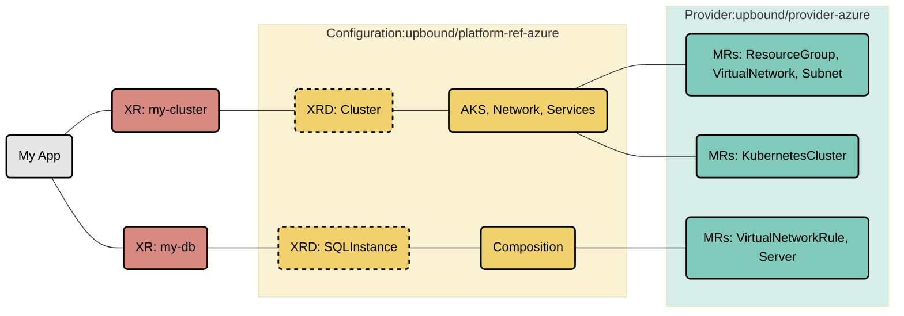
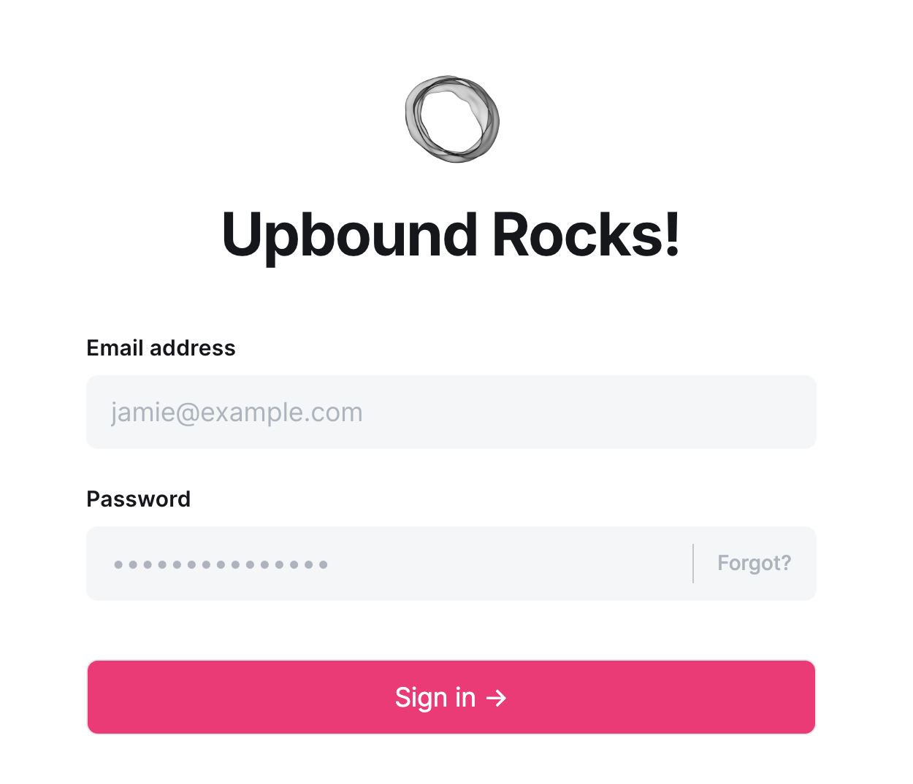

# Azure Reference Platform

This repository contains a reference Azure Platform Configuration for
[Crossplane](https://crossplane.io/) built with [Upbound DevEx](https://docs.upbound.io/devex/). It's a great starting point for building
internal cloud platforms with Azure and offer a self-service API to your internal
development teams.

This platform offers APIs for setting up fully configured AKS clusters
with secure networking, stateful cloud services (MySQL Database) that can securely
connect to the AKS clusters, an Observability Stack, and a GitOps
System. All these components are built using cloud service tools from
the [Official Upbound Family Azure Provider](https://marketplace.upbound.io/providers/upbound/provider-family-azure).
App deployments can securely connect to the infrastructure they need using secrets
distributed directly to the app namespace.

## Architecture

This platform uses **Upbound DevEx** with:
- **Embedded KCL Functions**: Pipeline-mode compositions with embedded KCL functions instead of external patch-and-transform
- **Test-Driven Development**: Comprehensive composition tests and e2e tests
- **Strong Typing**: KCL models for type-safe resource definitions
- **Modern Workflow**: `up project build`, `up test run`, and `up composition render` commands

## Overview

This reference platform outlines a specialized API for generating an AKS cluster
([Cluster](apis/clusters/definition.yaml)) that incorporates XRs from the specified configurations:

* [upbound-configuration-app](https://github.com/upbound/configuration-app)
* [upbound-configuration-azure-database](https://github.com/upbound/configuration-azure-database)
* [upbound-configuration-azure-aks](https://github.com/upbound/configuration-azure-aks)
* [upbound-configuration-azure-network](https://github.com/upbound/configuration-azure-network)
* [upbound-configuration-gitops-flux](https://github.com/upbound/configuration-gitops-flux)
* [upbound-configuration-observability-oss](https://github.com/upbound/configuration-observability-oss)



Learn more about Composite Resources in the [Crossplane
Docs](https://docs.crossplane.io/latest/composition/compositions/).

## Quickstart

### Installation

Install this platform from the [Upbound Marketplace](https://marketplace.upbound.io/configurations/upbound/platform-ref-azure/):

```console
up ctp configuration install xpkg.upbound.io/upbound/platform-ref-azure:v0.12.0
```

### Development Workflow

This platform uses **Upbound DevEx** for modern development:

```console
# Build the project and compile KCL functions
up project build

# Run composition tests
up test run tests/*

# Render compositions with examples
up composition render apis/clusters/definition.yaml apis/clusters/composition.yaml examples/cluster-xr.yaml
```

## Using the Platform

Once installed, you can create platform resources using the provided examples:

```console
# Create a cluster with networking, observability, and GitOps
kubectl apply -f examples/cluster-xr.yaml

# Create a MySQL database (after cluster is ready)
kubectl apply -f examples/mysql-xr.yaml

# Deploy a sample application
kubectl apply -f examples/app-xr.yaml
```

Monitor deployment status:

```console
kubectl get composite,managed
```

### Accessing Your Application

Once your Ghost application is deployed, you can access it using one of these methods:

#### Option 1: Via LoadBalancer (External IP)

Get the AKS cluster kubeconfig and access Ghost:

```bash
# Get the kubeconfig from the AKS connection secret
kubectl get secret <cluster-id>-akscluster -n default -o jsonpath='{.data.kubeconfig}' | base64 -d > /tmp/aks-kubeconfig

# Use the AKS kubeconfig to check Ghost service
export KUBECONFIG=/tmp/aks-kubeconfig
kubectl get svc -n ghost -l app.kubernetes.io/name=ghost
kubectl get pods -n ghost

# Get the external IP
EXTERNAL_IP=$(kubectl get svc -n ghost -l app.kubernetes.io/name=ghost -o jsonpath='{.items[0].status.loadBalancer.ingress[0].ip}')
echo "Ghost Frontend: http://$EXTERNAL_IP"
echo "Ghost Admin: http://$EXTERNAL_IP/ghost"
```

Then access:
- **Frontend**: `http://<EXTERNAL-IP>` (Your blog)
- **Admin**: `http://<EXTERNAL-IP>/ghost` (Admin interface)

You should see the Ghost admin login screen with "Upbound Rocks!" confirming your deployment:

<p align="center">
  
</p>

#### Option 2: Via kubectl port-forward (No external IP needed)

```bash
# Get the kubeconfig
kubectl get secret <cluster-id>-akscluster -n default -o jsonpath='{.data.kubeconfig}' | base64 -d > /tmp/aks-kubeconfig
export KUBECONFIG=/tmp/aks-kubeconfig

# Forward Ghost service to local port 8080
kubectl port-forward -n ghost svc/$(kubectl get svc -n ghost -l app.kubernetes.io/name=ghost -o jsonpath='{.items[0].metadata.name}') 8080:80

# Access in browser
open http://localhost:8080          # Frontend
open http://localhost:8080/ghost    # Admin interface
```

**Reset KUBECONFIG** when done:

```bash
unset KUBECONFIG
# or
export KUBECONFIG=~/.kube/config
```

## Development

### Testing

```console
# Run composition tests
up test run tests/*

# Run end-to-end tests
up test run tests/* --e2e
```

### Building and Publishing

```console
# Build the project
up project build

# Deploy locally
up project run
```

For publishing to the marketplace, see the [Upbound documentation](https://docs.upbound.io/devex/).

## Next Steps

- Explore the [examples](examples/) directory for usage patterns
- Check out the [Upbound DevEx documentation](https://docs.upbound.io/devex/) for advanced features
- Join the [Crossplane Slack](https://slack.crossplane.io) community