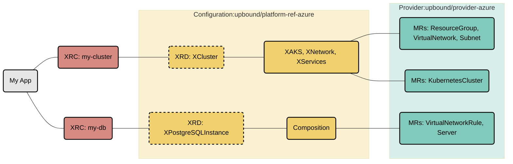

# Azure Reference Platform

This repository contains a reference Azure Platform Configuration for
[Crossplane](https://crossplane.io/). It's a great starting point for building
internal cloud platforms with Azure and offer a self-service API to your internal
development teams.

This platform provides APIs to provision fully configured AKS clusters, with
secure networking, and stateful cloud services (Azure PostgreSQL) designed to securely
connect to the nodes in each AKS cluster — all composed using cloud service
primitives from the [Official Upbound Azure
Provider](https://marketplace.upbound.io/providers/upbound/provider-azure). App
deployments can securely connect to the infrastructure they need using secrets
distributed directly to the app namespace.

## Overview

This reference platform defines a custom API for creating an AKS cluster
([XCluster](package/cluster/definition.yaml)) which includes the actual AKS
cluster, a network fabric and Prometheus and other cluster services
([XServices](package/cluster/composition.yaml)). Additionally it defines a
custom API for provisioning Postgres Databases
([XPostgreSQLInstance](package/database/postgres/definition.yaml)).




Learn more about Composite Resources in the [Crossplane
Docs](https://crossplane.io/docs/v1.9/concepts/composition.html).

## Quickstart

### Pre-Requisites

Before we can install the reference platform we want to install the `up` CLI.
This is a utility that makes following this quickstart guide easier. Everything
described here can also be done in a declarative approach which we highly
recommend for any production type use-case.
<!-- TODO enhance this guide: Getting ready for Gitops -->

To install `up` run this install script:
```console
curl -sL https://cli.upbound.io | sh
```
See [up docs](https://docs.upbound.io/cli/) for more install options.

For installing the platform we need a running Crossplane control plane. We are
using [Universal Crossplane (UXP)
](https://github.com/upbound/universal-crossplane). Ensure that your kubectl
context is pointing to the correct Kubernetes cluster or for example create a
[kind](https://kind.sigs.k8s.io) cluster:

```console
kind create cluster
```

Finally install UXP into the `upbound-system` namespace:

```console
up uxp install
```

You can validate the install by inspecting all installed components:

```console
kubectl get all -n upbound-system
```

### Install the Azure Reference Platform

Now you can install this reference platform. It's packaged as a [Crossplane
configuration package](https://crossplane.io/docs/v1.9/concepts/packages.html)
so there is a single command to install this package:

```console
up ctp configuration install xpkg.upbound.io/upbound/platform-ref-azure:v0.4.1
```

Validate the install by inspecting the provider and configuration packages:
```console
kubectl get providers,providerrevision

kubectl get configurations,configurationrevisions
```

Check the
[marketplace](https://marketplace.upbound.io/configurations/upbound/platform-ref-azure/)
for the latest version of this platform.

### Configure the Azure provider

Before we can use the reference platform we need to configure it with Azure
credentials:

```console
# Create a azure.json file with the azure cli:
# Replace <Subscription ID> with your subscription ID.
az ad sp create-for-rbac --sdk-auth --role Owner --scopes /subscriptions/<Subscription ID> \
  > azure.json

# Create a K8s secret with the Azure creds:
kubectl create secret generic azure-creds -n upbound-system --from-file=credentials=./azure.json

# Configure the Azure Provider to use the secret:
kubectl apply -f examples/azure-default-provider.yaml
```

See [provider-azure docs](https://marketplace.upbound.io/providers/upbound/provider-azure/latest/docs/configuration) for more detailed configuration options

## Using the Azure reference platform

🎉 Congratulations. You have just installed your first Crossplane powered
platform!

Application developers can now use the platform to request resources which than
will provisioned in Azure. This would usually done by bundling a claim as part of
the application code. In our example here we simply create the claims directly:

Create a custom defined cluster:
```console
kubectl apply -f examples/cluster-claim.yaml
```

Create a custom defined database:
```console
kubectl apply -f examples/postgres-claim.yaml
```

You can verify status by inspecting the claims, composites and managed
resources:

```console
kubectl get claim,composite,managed
```

To delete the provisioned resources you would simply delete the claims again:

```console
kubectl delete -f examples/cluster-claim.yaml,examples/postgres-claim.yaml
```

To uninstall the provider & platform configuration:

```console
kubectl delete configurations.pkg.crossplane.io upbound-platform-ref-azure
kubectl delete providers.pkg.crossplane.io upbound-provider-azure
kubectl delete providers.pkg.crossplane.io crossplane-contrib-provider-helm
```

## Customize for your Organization

So far we have used the existing reference platform but haven't made any
changes. Lets change this and customize the platform by ensuring that AKS
Cluster is deployed to Frankfurt (eu-central-1) and that clusters are limitted
to 10 nodes.

For the following examples we are using `my-org` and `my-platform`:

```console
ORG=my-org
PLATFORM=my-platform
```

### Pre-Requisites
First you need to create a [free Upbound
account](https://accounts.upbound.io/register) to push your custom platform.
Afterwards you can log in:

```console
up login --username=$ORG
```

### Make the changes

To make your changes clone this repository:

```console
git clone https://github.com/upbound/platform-ref-azure.git $PLATFORM && cd $PLATFORM
```

In the [AKS composition](package/cluster/aks/composition.yaml) find the
`location` definitions and change them from `West US 2` to `West Europe`. Also find the
`defaultNodePool[0].nodeCount` and change it from `1` to `3`.

### Build and push your platform

To share your new platform you need to build and distribute this package.

To build the package use the `up xpkg build` command:

```console
up xpkg build --name package.xpkg --package-root=package --examples-root=examples
```

Afterwards you can it to the marketplace. Don't worry it's private to you.

```console
TAG=v0.1.0
up repo create ${PLATFORM}
up xpkg push ${ORG}/${PLATFORM}:${TAG} -f package/package.xpkg
```

You can now see your listing in the marketplace:
```console
open https://marketplace.upbound.io/configurations/${ORG}/${PLATFORM}/${TAG}
```

## Using your custom platform

Now if you want to use it you can follow the steps from above. The only
difference is that you need to specify a package-pull-secret as the package is
currently private:

```console
up ctp pull-secret create personal-pull-secret
```

```console
up ctp configuration install xpkg.upbound.io/${ORG}/${PLATFORM}:${TAG} --package-pull-secrets=personal-pull-secret
```

For alternative declarative installation approach see the [example Configuration
manifest](examples/configuration.yaml). Please update to your org, platform and
tag before applying.

🎉 Congratulations. You have just build and installed your first custom
Crossplane powered platform!


## Questions?

For any questions, thoughts and comments don't hesitate to [reach
out](https://www.upbound.io/contact) or drop by
[slack.crossplane.io](https://slack.crossplane.io), and say hi!
